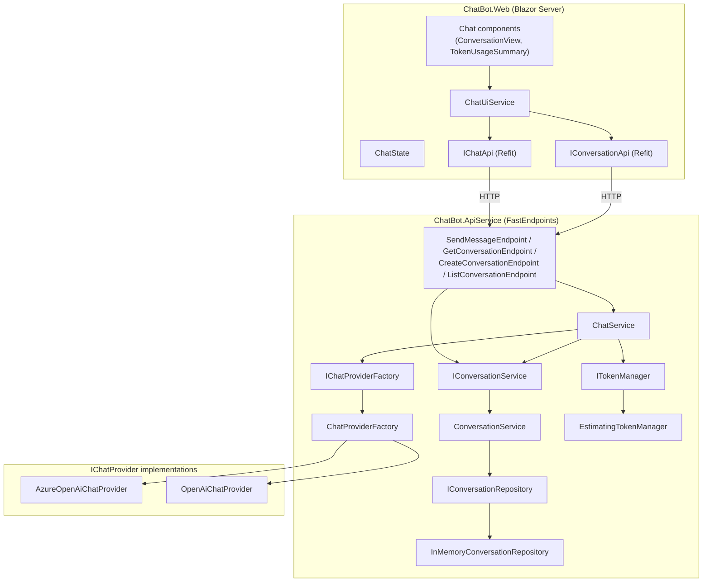
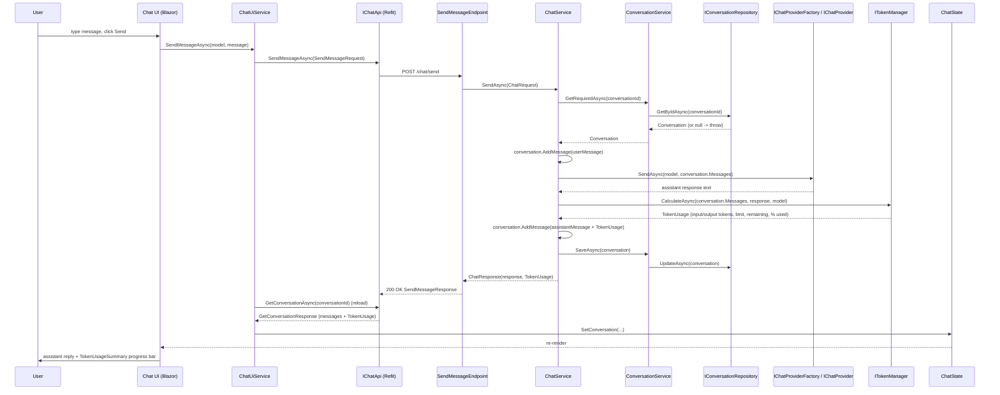

# ChatBot

A small chat application built on **.NET Aspire**. A Blazor Server front end talks to a backend API, which forwards chat requests to a chat model provider and returns the conversation back to the UI.

The API is provider-agnostic: chat requests are routed through an `IChatProvider` abstraction, so new providers (OpenAI, Anthropic Claude, a local Ollama server, etc.) can be added by implementing the interface and registering it — no changes to the chat business logic. See [Provider architecture](#provider-architecture) below.

## Projects

| Project | Description |
|---|---|
| `ChatBot.AppHost` | .NET Aspire orchestrator — starts and wires up the API and Web app together, with the Aspire dashboard for logs/traces. |
| `ChatBot.ApiService` | Backend API (FastEndpoints) that manages conversations and calls Azure OpenAI via `Microsoft.Extensions.AI`. |
| `ChatBot.Web` | Blazor Server front end (InteractiveServer render mode) that calls the API via Refit. |
| `ChatBot.ServiceDefaults` | Shared Aspire service defaults: OpenTelemetry, health checks, service discovery, HTTP resilience. |

## Technologies

- .NET 10 / C# (`net10.0`)
- .NET Aspire 13.2.4 (`Aspire.AppHost.Sdk`)
- ASP.NET Core, Blazor Server (`InteractiveServer` render mode)
- FastEndpoints 8.2.0 (+ `FastEndpoints.AspVersioning`)
- Refit 13.1.0 (typed HTTP clients, Web → API)
- Azure.AI.OpenAI 2.1.0, Azure.Identity 1.21.0
- Microsoft.Extensions.AI / Microsoft.Extensions.AI.OpenAI 10.7.0
- Microsoft.Extensions.Http.Resilience 10.2.0 (Polly-based resilience)
- Microsoft.Extensions.ServiceDiscovery 10.2.0
- OpenTelemetry (ASP.NET Core, HTTP client, runtime instrumentation) 1.15.x
- Scalar.AspNetCore 2.16.11 (OpenAPI UI for the API)

## Architecture

The backend is layered by responsibility, and each layer only talks to the layer below through an interface:

- **Endpoints** (`Features/*/​*Endpoint.cs`, FastEndpoints) — HTTP in/out only, no business logic.
- **Application services** (`ChatService`, `ConversationService`) — orchestrate a use case.
- **Abstractions** (`IConversationService`, `IChatProviderFactory` / `IChatProvider`, `ITokenManager`) — the only things application services depend on.
- **Infrastructure** (`InMemoryConversationRepository`, `AzureOpenAiChatProvider`, `OpenAiChatProvider`, `EstimatingTokenManager`) — concrete, swappable implementations, registered in `ServiceCollectionExtensions.AddInfrastructure`.

Notably, `ChatService` never talks to `IConversationRepository` directly — only `ConversationService` does. `ChatService` depends on `IConversationService`, which exposes two different lookup contracts for two different needs:

- `GetAsync` — nullable "try get", returns `null` if the conversation doesn't exist. Used by `GetConversationEndpoint` to return an HTTP 404.
- `GetRequiredAsync` — throws if the conversation doesn't exist. Used by `ChatService`, which has no message to send if the conversation it's replying to isn't there.

Token usage is calculated the same way: `ChatService` doesn't count tokens itself. It hands `ITokenManager.CalculateAsync` the actual `ConversationMessage` collection sent to the provider plus the raw assistant response, and gets back a `TokenUsage` (input/output token counts, context limit, remaining budget, percentage used). `EstimatingTokenManager` is a character-length heuristic today; it can be swapped for a real tokenizer (e.g. Tiktoken) without touching `ChatService` or any endpoint.



### End-to-end: sending a message



## Provider architecture

The API talks to chat models through an `IChatProvider` abstraction (`ChatBot.ApiService/Features/Chat/Contracts/IChatProvider.cs`), not directly against any SDK. Each provider implements:

```csharp
public interface IChatProvider
{
    string Name { get; }
    bool CanHandle(string model);
    Task<string> SendAsync(string model, IReadOnlyCollection<ConversationMessage> messages, CancellationToken cancellationToken = default);
}
```

All registered `IChatProvider` instances are injected into `ChatProviderFactory`, which picks the first provider whose `CanHandle(model)` returns `true` for the requested model. `ChatService` only depends on `IChatProviderFactory` — it has no knowledge of Azure OpenAI, OpenAI, or any other vendor.

Two providers exist today, wired up in `ServiceCollectionExtensions.AddInfrastructure`:

- `AzureOpenAiChatProvider` — uses `Microsoft.Extensions.AI` (`IChatClient`) against an Azure OpenAI deployment. Its `CanHandle` always returns `true`, so it acts as the default/catch-all.
- `OpenAiChatProvider` — uses the `OpenAI` SDK directly. Its `CanHandle` returns `true` only for models listed under `ChatProviders:OpenAI:Models`.

### Adding another provider (Claude, Ollama, etc.)

No business logic needs to change — `ChatService` and the API endpoints stay the same. To add a new provider:

1. Add an options class under `Infrastructure/Configuration` (e.g. `OllamaOptions`) with a `SectionName` and whatever fields the provider needs (base URL, API key, model list, ...).
2. Add a matching section under `ChatProviders` in `appsettings.json` (e.g. `ChatProviders:Ollama`).
3. Implement `IChatProvider` under `Infrastructure/Providers/<ProviderName>`, deciding which models it handles in `CanHandle` (e.g. match against its configured model list, or a name prefix like `"claude-"`).
4. Register it in `ServiceCollectionExtensions.AddInfrastructure`:
   ```csharp
   services.Configure<OllamaOptions>(configuration.GetSection(OllamaOptions.SectionName));
   services.AddSingleton<IChatProvider, OllamaChatProvider>();
   ```
   Register more specific providers (e.g. ones with a restrictive `CanHandle`) before `AzureOpenAiChatProvider`, since its `CanHandle` always returns `true` and would otherwise match first.

Because each provider is a self-contained `IChatProvider`, a local model server like Ollama can be added the same way — its provider just points `SendAsync` at a local HTTP endpoint (e.g. `http://localhost:11434`) instead of a cloud API.

## Prerequisites

- [.NET 10 SDK](https://dotnet.microsoft.com/download)
- An **Azure OpenAI** resource with a chat model deployed (e.g. `gpt-4o`), plus its endpoint URL, API key, and deployment name

## Configuration

Each provider reads its own section under `ChatProviders` in `ChatBot.ApiService/appsettings.json`. Azure OpenAI is registered as the default provider (it handles any model not claimed by another provider); OpenAI is included as a second example provider, enabled for whatever models are listed under it:

```json
"ChatProviders": {
  "AzureOpenAI": {
    "Endpoint": "default",
    "ApiKey": "default",
    "DeploymentName": "gpt-4o",
    "Models": [ "gpt-4o" ]
  },
  "OpenAI": {
    "ApiKey": "default",
    "BaseUrl": "default",
    "Models": [ ]
  }
}
```

You only need to fill in the section(s) for the provider(s) you actually use — leave `OpenAI` with empty `Models` if you're not using it.

Don't put real credentials in `appsettings.json` — set them locally with `dotnet user-secrets` instead:

```bash
cd ChatBot.ApiService
dotnet user-secrets init
dotnet user-secrets set "ChatProviders:AzureOpenAI:Endpoint" "https://<your-resource>.openai.azure.com/"
dotnet user-secrets set "ChatProviders:AzureOpenAI:ApiKey" "<your-api-key>"
dotnet user-secrets set "ChatProviders:AzureOpenAI:DeploymentName" "<your-deployment-name>"
```

(Alternatively, set the equivalent `ChatProviders__AzureOpenAI__*` environment variables.)

## Running the app

From the repo root:

```bash
dotnet run --project ChatBot.AppHost
```

This starts the API, the Web app, and the Aspire dashboard. Open the dashboard URL printed in the console to see both resources, their logs, and traces, and to get the link to the running Web app.
